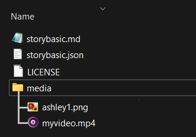

# Chatfic Format
Chatfic Format with docs, examples and tools for conversion.

## 1. QUICK START
You can start creating your chatfic stories in the "chatficbasic" format by simply following these steps:

> If you already have your chatfic in another format, you can take a look at the [Converters](#converters) section of this documentation.

### Option 1: Using a Chatfic Editor (Easy and Quick)
You can use [The Chatfic Editor](https://editor.chatficlab.com) to create chatfics easily. The steps are pretty straightforward:
1. Fill out the Story Info form.
2. (If the story is Non-linear) Create pages and page links.
4. Add messages. (Create or modify characters if needed.)
5. Download the zip file and submit it to a chatfic server.

### Option 2: Manually (Advanced)

1. **Create a new chatfic:** Open a text editor and create a new file named **storybasic.md**.

    Begin your chatfic file by specifying story info at the beginning of the file. Add your #pages and user: messages after that.
    #### show/hide Example +
    ```chatficbasic
    > format: chatficbasic
    > version: 1
    > title: Your Story Title
    > description: A brief description of your story.
    > author: /u/yourusername
    > patreon-username: yourpatreonusername
    > episode: 1
    > characters/player/name: John
    > characters/alice/name: Alice

    
    # initial
    alice:  Hi! how are you?
    player:  Thank you Alice, I'm fine. you?
    alice:  Me too! Here is a photo from yesterday:
    alice:  

    [like it](#nicepath)
    [say eww](#badpath)

    # nicepath
    player(Alice):  nice!

    [next](#ending)

    # badpath
    player(Alice):  eww.
    alice:  ??!

    [next](#ending)

    # ending
    app(Alice):  thanks for playing, the story is finished!
    ```
2. Create a folder named **media** and put all your media files in it.
3. Create a storybasic.json counterpart of your storybasic.md. You can do this by:
    - Importing your chatfic to [The Chatfic Editor](https://editor.chatficlab.com) and clicking the "Show JSON (v1)" button
    - Using a [converter](#converters)
    - Or creating it manually (not recommended). Here is what it should look like:
    #### show/hide json code +
    ```json
    {
    "format": "chatficbasicjson",
    "title": "Your Story Title",
    "description": "A brief description of your story.",
    "author": "/u/yourusername",
    "patreonusername": "yourpatreonusername",
    "episode": 1,
    "characters": {
        "player": {"name": "John"},
        "app": {"name": "app"},
        "alice": {"name": "Alice"}
    },
    "pages": [
        {
        "id": 1,
        "name": "initial",
        "messages": [
            {
            "message": "Hi! how are you?",
            "from": "alice",
            "side": "0",
            "multimedia": null,
            "chatroom": "Alice"
            },
            {
            "message": "Thank you Alice, I'm fine. you?",
            "from": "player",
            "side": "2",
            "multimedia": null,
            "chatroom": "Alice"
            },
            {
            "message": "Me too! Here is a photo from yesterday:",
            "from": "alice",
            "side": "0",
            "multimedia": null,
            "chatroom": "Alice"
            },
            {
            "message": "",
            "from": "alice",
            "side": "0",
            "multimedia": "media/media/myphoto.jpg",
            "chatroom": "Alice"
            }
        ],
        "options": [ { "to": 2, "message": "like it" }, { "to": 3, "message": "say eww" } ]
        },
        {
        "id": 2,
        "name": "nicepath",
        "messages": [
            {
            "message": "nice!",
            "from": "player",
            "side": "2",
            "multimedia": null,
            "chatroom": "Alice"
            }
        ],
        "options": [ { "to": 4 } ]
        },
        {
        "id": 3,
        "name": "badpath",
        "messages": [
            {
            "message": "eww.",
            "from": "player",
            "side": "2",
            "multimedia": null,
            "chatroom": "Alice"
            },
            {
            "message": "??!",
            "from": "alice",
            "side": "0",
            "multimedia": null,
            "chatroom": "Alice"
            }
        ],
        "options": [ { "to": 4 } ]
        },
        {
        "id": 4,
        "name": "ending",
        "messages": [
            {
            "message": "thanks for playing, the story is finished!",
            "from": "app",
            "side": "1",
            "multimedia": null,
            "chatroom": "Alice"
            }
        ],
        "options": []
        }
    ]
    }
    ```
4. Create a zip archive with storybasic.md, storybasic.json and your media folder. You can include a LICENSE file too.


### Chatfic Archives
Since most chatfics consist of both a story and a collection of media files, chatfic format is not only about how to format your story. To make an entire chatfic story easy to distribute and easy to work with, one should create an archive file, with the below structure:



**storybasic.md:** This is the file for storing the default(markdown-based) chatficbasic code.

**storybasic.json:** This is the JSON based version of the chatficbasic code. This will usually get generated by a chatfic editor like [The Chatficlab Editor](https://editor.chatficlab.com).
The reason we have both the .md version and the .json version together is to make it easier for authors to import or edit the story using any editor available to them. This decision may change with future major versions of the chatfic format.

**media/**: This folder contains all the media files used in the story. Accepted formats for chatfic v1: `jpeg, jpg, png, gif, webm, mp4`

**LICENSE**: Optional but strongly recommended text file with license information. This file may or may not have a .txt or .md extension.

**story.json:** This file will get generated automatically by the chatfic servers and **the author shouldn't include this file in the archive**. The difference between this and storybasic.json can be found under the section "[Publish](#publish)". But basically, storybasic is the source code, used by the editors, and story.json is the compiled and extended version of it, only used by the chatfic players like [chatficlab.com](https://chatficlab.com)


### Tutorial
We currently don't have any tutorials. Please check the examples below or play with [the editor](https://editor.chatficlab.com) to understand how things work.

## 2. SEE EXAMPLES
You can find a complete chatfic archive in the /examples folder of our github repo:
https://github.com/gokhanmeteerturk/chatfic-format/tree/main/examples/example-1

Or directly download the archive: [example-1.zip](https://github.com/gokhanmeteerturk/chatfic-format/raw/main/examples/example-1.zip)

## 3. SPECIFICATION

The "chatficbasic" format is a simple and structured way to create interactive chat-based stories. It allows authors to write stories using a conversational format, with multiple characters, non-linear story choices and multimedia elements.

> Chatficbasic can be seen as a strict subset of markdown. The recommended file extension is .md, which helps it to be viewed/navigated seamlessly using markdown editors too.

### Format Metadata
- **Format Name:** chatficbasic
- **Version:** 1

### Story Metadata
- **Title:** [Your Story Title]
- **Description:** [A brief description of your story, one line.]
- **Author:** [Your username. ex: /u/me420 or @me420]
- **Patreon Username**: [Your Patreon username, without the domain.]

#### Metadata Example
```chatficbasic
> format: chatficbasic
> version: 1
> title: Test Story - Look Up at the Sky
> description: This is a simple test story.
> author: /u/yourusername
> patreon-username: yourpatreonusername
> episode: 1
```
### Characters
Characters are defined within the "characters" section and can have attributes. Currently supported attributes are name, color, and avatar. Additional attributes may be included with v1.x minor updates, so parsers and renderers should expect to encounter unknown additional attributes.

"player" and "app" character slugs are reserved. The "app" slug should never appear in the characters section of your story metadata. While "player" should definitely appear:

**Example:**

```chatficbasic
> characters/player/name: John
> characters/alice/name: Alice
> characters/alice/color: #0000FF
> characters/bob/name: Bob
> characters/bob/avatar: bob.jpg
> characters/mike/name: Mike
> characters/jes/name: Jessica
```

### Story Content
The story is divided into pages, each identified by a unique, **one word** label. Pages contain character dialogue.

Each page ends with either a redirect to another page, multiple choices for the player to make, or nothing(which means the story ends after the page).

For editors, the default first page is called "initial". This can be changed by the author.

**Example:**
```chatficbasic
# initial
alice: Hello, I'm Alice.
player: Hi Alice!
alice:  How are you?

[Respond to Alice](#second)
[Text to Bob instead](#third)

# second
...
```
Each page begins with a label (e.g., # initial) followed by character dialogue.

Choices are presented in square brackets with a label linking to the next page.

>If a page ends with a single option, it will be considered a redirect. A redirect doesn't wait for the player to make a choice, and won't show the text inside the square brackets to the player either.

### Chatroom Names
In chatfic format, each message belongs in a chatroom. If the player is having a 1-on-1 conversation with a character, the chatroom name will be the character's name.

If the player is in a group conversation, the chatroom name should be specified manually.

The chatroom can be specified by appending the chatroom name in parentheses after the author's name.

If the chatroom is not specified, the chatroom will be determined by the author of the previous message:
```chatficbasic
mike: hi!
player: hello!
```
> "pov" is a reserved word and should never be used as a chatroom name.


> If any message's chatroom is ambiguous and can't be determined correctly based on the author of the **previous** messages, chatroom **must be** specified using the chatroom name in parentheses. For example, if the first message belongs to the player, chatroom must be specified at least once:
```chatficbasic
player(Bob): Hello Bob!
Bob: Hi!
player: How are you?
Bob: Good. you?
```

### Group and Non-player chats
For group chats, the chatroom name should be specified manually. For example:
```chatficbasic
mike(The Boyz): Hello guys, did you watch "foo"?
george: Nope!
player: I watched "bar". Does that count?
```

Chatfics are default to the "player"s point-of-view(aka POV). This means the player's messages are shown on the right side of the chatroom. If you want any other character's messages to be seen on the right side, you can use "(pov)" after the chatroom name.

Below is an example chat between non-player characters "Alice" and "Mike". We will name this chatroom "Alice-Mike". It is not a strict convention but it's recommended to use the chatroom name "character1-character2" for non-player chats to avoid any confusion.

```chatficbasic
alice(Alice-Mike)(pov): Hello Mike!
mike: Hi Alice!
alice(pov): Did you go to the party last night?
mike: nope :(
```

### Multimedia
Multimedia elements can be embedded using the [IMAGE] and [VIDEO] tags.

The file name should be specified within the parentheses. A multimedia can be sent along with a text message, by adding text **after** the multimedia element:

**Example:**
```chatficbasic
alice: 
mike:  Here's a video from me!
```
### App / Narrator Messages
Messages from the app or the narrator should be prepended by "app:".

**Example:**
```chatficbasic
jessica: Hi!
player: hi jessica!
app: Missed voice call
jessica: Ah sorry, that was an accidental call.
player: no worries!
```
### End of Story
If the player ends up in a page with no options at the end, the story will end. It is usually a good practice to end the story with a message from the narrator:

```chatficbasic
app: Story ended, thanks for playing.
```

## 4. TOOLS AND 3RD PARTY PROJECTS

Currently tools for editing a chatfic are limited to an online editor and several converters. If you publish a tool for anything chatfic format related, you can request to be listed here by opening a new issue.

### Editors
A proof-of-work online editor project is published on GitHub under the name [@gokhanmeteerturk/chatficbasic-html-editor](https://github.com/gokhanmeteerturk/chatficbasic-html-editor).

### Converters
Work in progress

### Other Tools
Work in progress
